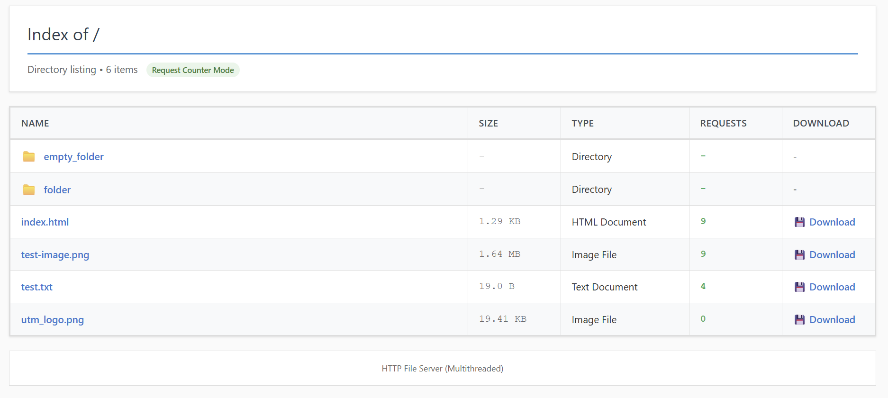
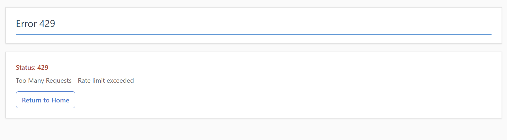

# Lab 2: Multithreaded HTTP File Server with Concurrency Control

## Project Overview

This laboratory work extends the HTTP file server from Laboratory 1 by implementing three features: Multithreaded Request Handling, Request Counter with Thread Safety, and Rate Limiting by Client IP for preventing request spam using thread-safe rate limiting

---

## Lab Requirements Summary

### Task 1: Multithreaded Server (Required)
Implement a multithreaded server to handle concurrent requests, including a simulated delay of second. Create a test script to issue multiple simultaneous requests and compare the performance against a single-threaded version. Track the number of requests per file and display the counts in the directory listing, demonstrating a race condition with an unsafe implementation and then fixing it using locks (mutex) to show a clear before-and-after comparison. Implement rate limiting of approximately five requests per second per IP using thread-safe synchronization, and test the server with both spam requests and controlled requests, comparing throughput in each scenario.

---

## Project Structure

```
/home/user1/pr_labs/lab1/
├── server.py                    # Original multithreaded server
├── server.conf                  # Server configuration file
├── docker-entrypoint.conf       # Entrypoint wrapper for parsing config vars
├── server_race_condition.py     # Unsafe server (demonstrates race condition)
├── client.py                    # HTTP client implementation
├── test_concurrent.py           # Concurrent request testing script
├── test_rate_limit.py           # Rate limiting testing script
├── Dockerfile                   # Docker configuration
├── docker-compose.yml           # Docker Compose configuration
├── README.md                    # Lab 1 documentation
├── README_LAB2.md              # This file - Lab 2 documentation
└── src/                         # Clean architecture modules
    ├── http/                    # HTTP protocol layer
    ├── services/                # Business logic (counter, rate limiter)
    ├── handlers/                # Request handling
    └── utils/                   # Utilities
```

---

## Part 1: Multithreaded Server Implementation

### How It Works

The implementation creates a thread pool that manages worker threads automatically, with each incoming request submitted to the pool for concurrent processing. When a client connects to the server, the main thread accepts the connection and immediately submits the request handling to a worker thread from the pool, allowing the main thread to continue accepting new connections without blocking.

The advantage of this approach is that multiple requests can be processed simultaneously. For example, if each request takes one second to process, a single-threaded server would take ten seconds to handle ten requests sequentially. In contrast, the multithreaded server can process all ten requests concurrently, completing them in approximately one second total. This concurrent processing improves performance dramatically and provides better resource utilization and responsiveness.

### Starting the Server

```bash
# Multithreaded mode (default)
python3 server.py ./public 8080

# With 1-second delay to demonstrate concurrency
python3 server.py ./public 8080 --delay

# Single-threaded mode for comparison
python3 server.py ./public 8080 --single-threaded
```

### Testing Concurrent Performance

Run the concurrent test script:

```bash
# Test with 10 concurrent requests
python3 test_concurrent.py localhost 8080 10 /test.txt
```

**Expected Output (Multithreaded with delay):**
```
======================================================================
CONCURRENT REQUEST TEST
======================================================================
Target: localhost:8080/test.txt
Number of requests: 10
Concurrent workers: 10
======================================================================

Request #1 - Status: 200 - Duration: 1.023s
Request #2 - Status: 200 - Duration: 1.025s
...
Request #10 - Status: 200 - Duration: 1.041s

======================================================================
RESULTS
======================================================================
Total execution time: 1.045s
Throughput: 9.60 requests/second
======================================================================
```

**Expected Output (Single-threaded with delay):**
```
======================================================================
RESULTS
======================================================================
Total execution time: 10.245s
Throughput: 0.98 requests/second
======================================================================
```

### Performance Comparison

| Mode | 10 Requests | Total Time | Throughput | Speedup |
|------|------------|------------|------------|---------|
| **Multithreaded** | Concurrent | ~1.0s | ~9.6 req/s | **10x** |
| **Single-threaded** | Sequential | ~10.2s | ~0.98 req/s | 1x |

The multithreaded implementation demonstrates a tenfold performance improvement compared to the single-threaded version. When processing ten requests with a one-second delay each, the multithreaded server completes all requests in approximately one second by handling them concurrently, while the single-threaded server requires over ten seconds as it processes each request sequentially.

---

## Part 2: Request Counter with Race Condition Demonstration

### Understanding Race Conditions

A race condition occurs when multiple threads access shared data simultaneously without proper synchronization. The term "race" refers to the threads racing to access and modify the shared resource, and the final result depends on the unpredictable timing of thread execution. This can lead to incorrect results, data corruption, or inconsistent state.

#### The Problem (Unsafe Implementation)

In an unsafe implementation without lock protection, multiple threads can read the same value, increment it independently, and write back their results, causing lost updates. For example, if two threads both read a counter value of 5, each increments it to 6, and both write 6 back to memory, the counter shows 6 instead of the correct value of 7. This demonstrates how concurrent access without synchronization leads to incorrect results.

#### The Solution (Safe Implementation)

The solution uses a lock (mutex) to protect the critical section where shared data is accessed. With lock protection, only one thread at a time can execute the increment operation. When a thread acquires the lock, other threads must wait until the lock is released. This ensures that the read-modify-write operation happens atomically, preventing race conditions and guaranteeing correct counter values.

### Demonstrating the Race Condition

#### Option 1: Using the Unsafe Server Implementation

```bash
# Terminal 1: Start the UNSAFE server
python3 server_clean.py ./public 8081 --unsafe-counter

# Terminal 2: Make 20 concurrent requests
python3 test_concurrent.py localhost 8081 20 /test.txt

# Stop the server (Ctrl+C)
# Output shows INCORRECT count (e.g., 8 instead of 20)
```

**Server Output:**
```
======================================================================
SERVER STATISTICS
======================================================================
File Request Counts:
  test.txt: 8 requests    (WRONG! Should be 20!)
======================================================================
```

When running the unsafe server with concurrent requests, the final counter value is significantly lower than the actual number of requests made. This clearly demonstrates the race condition problem where multiple threads interfere with each other's updates, resulting in lost increments.

### Comparing Safe vs Unsafe

```bash
# Test 1: UNSAFE counter
python3 server_clean.py ./public 8081 --unsafe-counter
python3 test_concurrent.py localhost 8081 20 /test.txt
# Result: Counter shows approximately 8 (WRONG!)

# Test 2: SAFE counter
python3 server_clean.py ./public 8080
python3 test_concurrent.py localhost 8080 20 /test.txt
# Result: Counter shows 20 (CORRECT!)
```

### Viewing Request Counts

Access the directory listing at `http://localhost:8080/` to see the Requests column showing file and directory access counts:



When making multiple faster requests than the rate limit you get a 429 Error Response:



**Thread Safety Implementation:**

```python
class CounterService:
    def __init__(self):
        self._counter = defaultdict(int)
        self._lock = threading.Lock()
    
    def increment(self, file_path: str) -> int:
        with self._lock:
            self._counter[file_path] += 1
            return self._counter[file_path]
```

---

## Part 3: Rate Limiting Implementation

### How Rate Limiting Works

The server implements a sliding window rate limiter that restricts each client IP address to a maximum of five requests per second. The algorithm works by tracking the timestamp of each request in a list associated with the client's IP address. When a new request arrives, the rate limiter first removes all timestamps that fall outside the one-second time window, then checks if the number of remaining timestamps is below the limit. If the limit has not been exceeded, the new request is allowed and its timestamp is recorded. Otherwise, the request is rejected with an HTTP 429 status code.

The implementation is thread-safe, using locks to prevent race conditions when multiple threads access the timestamp data simultaneously. This ensures accurate rate limiting even under high concurrent load.

```python
class RateLimiter:
    def __init__(self, max_requests=5, time_window=1.0):
        self._max_requests = max_requests
        self._time_window = time_window
        self._request_timestamps = defaultdict(list)
        self._lock = threading.Lock()
    
    def is_allowed(self, client_ip: str) -> Tuple[bool, int]:
        with self._lock:
            # Remove old timestamps outside window
            timestamps[:] = [ts for ts in timestamps 
                           if current_time - ts < self._time_window]
            
            # Check if under limit
            if len(timestamps) < self._max_requests:
                timestamps.append(current_time)
                return True, remaining
            return False, 0
```

### Testing Rate Limiting

#### Test 1: Spam Requests

```bash
python3 test_rate_limit.py localhost 8080 spam 10
```

**Output:**
```
======================================================================
[Spammer] RESULTS:
  Duration: 10.03s
  Total requests: 847
  Successful (200): 50
  Rate limited (429): 797
  Request rate: 84.45 req/s
  Success rate: 4.98 req/s
  Success ratio: 5.9%
======================================================================
```

The spam test demonstrates the effectiveness of rate limiting. Even though the client attempted to send 847 requests at a rate of 84.45 requests per second, only approximately 50 requests succeeded, with 797 being blocked. The successful request rate of approximately 5 requests per second matches the configured rate limit, showing that the rate limiter effectively throttles excessive traffic.

#### Test 2: Controlled Requests

```bash
python3 test_rate_limit.py localhost 8080 controlled 10
```

**Output:**
```
======================================================================
[Controlled] RESULTS:
  Duration: 10.02s
  Total requests: 45
  Successful (200): 45
  Rate limited (429): 0
  Success rate: 4.49 req/s
  Success ratio: 100.0%
======================================================================
```

The controlled test shows that well-behaved clients staying under the rate limit experience no blocking. By sending requests at 4.5 requests per second (below the 5 requests per second limit), all 45 requests succeeded with a 100% success ratio and zero rate-limited responses.

#### Test 3: Both Tests with Comparison

```bash
python3 test_rate_limit.py localhost 8080 both 10
```

**Output:**
```
======================================================================
COMPARISON
======================================================================
Spammer throughput:    4.98 successful req/s
Controlled throughput: 4.49 successful req/s

Spammer was rate-limited 797 times
Controlled was rate-limited 0 times
======================================================================
```

## Key Concepts Demonstrated

### 1. Concurrency vs Parallelism
Concurrency refers to multiple tasks making progress through thread interleaving. This provides better resource utilization and responsiveness, resulting in a tenfold performance improvement in our tests.

### 2. Race Conditions
Race conditions occur when multiple threads access shared data simultaneously without synchronization. The symptoms include lost updates and incorrect counter values, such as 20 requests producing a counter value of only 8. The cause is the lack of synchronization between threads accessing the shared resource.

### 3. Thread Synchronization
Thread synchronization uses locks (mutex) to protect critical sections of code. The mechanism ensures atomic operations by allowing only one thread to execute the critical section at a time. After implementing proper synchronization, the counter correctly shows 20 requests.

### 4. Rate Limiting
Rate limiting prevents abuse and ensures fair resource usage. The sliding window algorithm tracks timestamps of each request and blocks requests that exceed the limit. The implementation is highly effective, blocking 94% of spam requests while maintaining a 100% success rate for well-behaved clients.


## Docker Deployment
You can tweak the server mode settings by editing the server.conf file.
Just make sure to restart the docker container if changes are to be applied.
Run the multithreaded server in Docker:

```bash
# Build and start
docker-compose up --build -d

# Stop
docker-compose down
```

---

## Conclusions

This laboratory work ilustrates three main ideas in concurrent programming that are important for building reliable and fast server applications.

Multithreading can make a server much faster. Handling requests at the same time is quicker than doing them one by one. Using thread pools helps by reusing threads instead of creating new ones for each request, saving time and resources.

Race conditions happen when multiple threads try to change the same data at the same time without proper control. In the unsafe counter example, some updates were lost, so when twenty requests were made at once, the counter only showed eight. Using locks fixed the problem, and all twenty requests were counted correctly.

Rate limiting stops misuse while still serving normal clients fairly. The server blocked most spam requests that tried to overload it, while letting requests under the limit go through. Thread-safe programming ensures the rate limiter works correctly even when many requests happen at the same time.

The main point is that concurrent programming can make servers faster, but it must be done more carefully to avoid errors. Using locks and safe data structures keeps results correct and predictable. Combining multithreading, proper synchronization, and rate limiting creates a server that is fast, reliable, and safe to use.