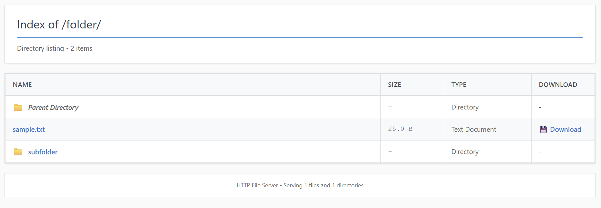
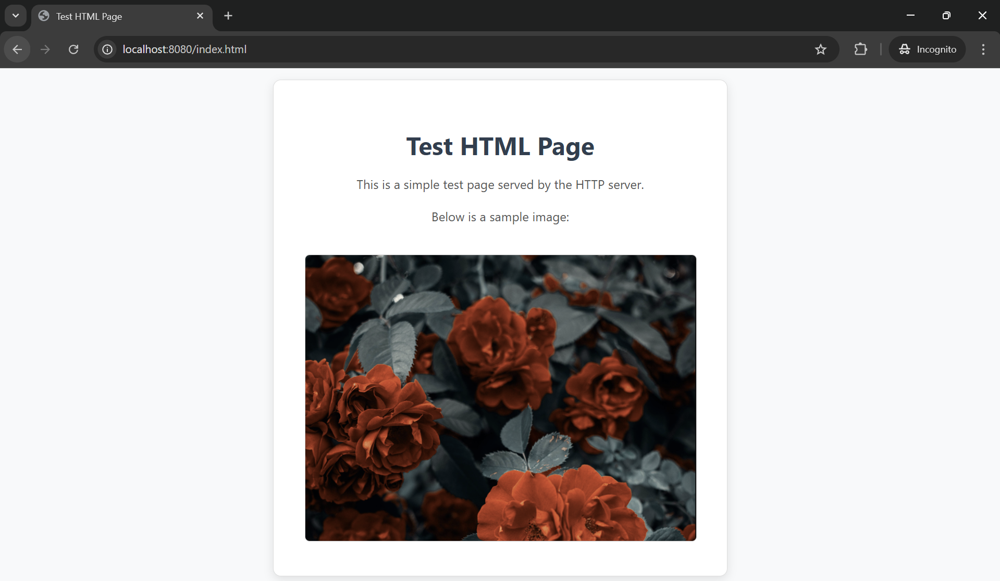
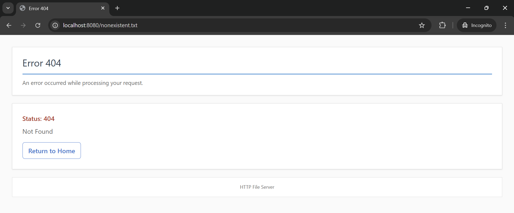
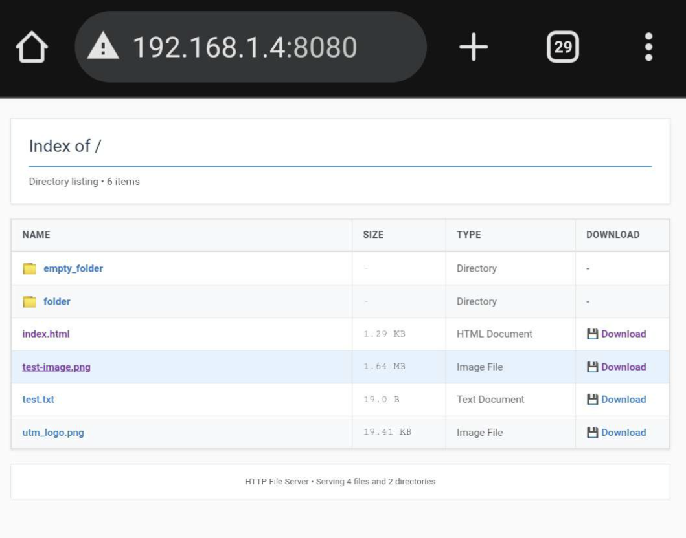

# Lab 1: HTTP File Server with TCP Sockets

## Project Overview

This project implements a simple HTTP file server using Python and TCP sockets. The server can serve files, generate directory listings, and handle various MIME types. An HTTP client is also provided to download files from the server.

---

## Source Directory Contents

```
/home/user1/pr_labs/lab1/
├── server.py              # HTTP server implementation
├── client.py              # HTTP client implementation  
├── Dockerfile             # Docker image configuration
├── docker-compose.yml     # Docker Compose configuration
├── README.md              # This file
├── client_saves/          # Directory where client saves downloaded files
│   ├── sample.pdf
│   ├── sample.txt
│   └── utm_logo.png
└── public/                # Directory served by the HTTP server
    ├── index.html
    ├── test-image.png
    ├── test.txt
    ├── utm_logo.png
    ├── empty_folder/
    └── folder/
        ├── sample.txt
        └── subfolder/
            ├── nested.txt
            └── sample.pdf
```

---

## Docker Configuration

### Dockerfile
```dockerfile
FROM python:3.10-slim

WORKDIR /app

COPY server.py /app/
COPY public/ /app/public/

EXPOSE 8080

CMD ["python3", "server.py", "/app/public", "8080"]
```

### docker-compose.yml
```yaml
services:
  file-server:
    build: .
    ports:
      - "8080:8080"
    volumes:
      - ./public:/app/public
    restart: unless-stopped
    container_name: http-server
    environment:
      - PYTHONUNBUFFERED=1
```

---

## Running with Docker Compose

### Prerequisites
Make sure you have Docker and Docker Compose installed on your system
### Step-by-Step Instructions

#### 1. Navigate to Project Directory
```bash
cd /home/user1/pr_labs/lab1
```

#### 2. Check Files Are Present
```bash
ls -la
# Should show: server.py, docker-compose.yml, Dockerfile, public/, etc.
```

#### 3. Build and Start the Container
```bash
# Build the image and start the container
docker-compose up --build

# Expected output:
# [+] Building 2.3s (8/8) FINISHED
# [+] Running 1/1
#  ✔ Container http-server  Created
#  ✔ Container http-server  Started
# [SERVER] Serving files from: /app/public
# [SERVER] Starting server on 0.0.0.0:8080
# [SERVER] Server running at http://0.0.0.0:8080
# [SERVER] Press Ctrl+C to stop
```

#### 4. Run in Detached Mode
```bash
# Run in background
docker-compose up -d --build

# Check if running:
docker-compose ps
```

#### 5. View Server Logs
```bash
# View real-time logs
docker-compose logs -f file-server

# View recent logs
docker-compose logs --tail=50 file-server
```

#### 6. Stop the Server
```bash
# Stop the container
docker-compose down

```

---

## Server Command Inside Container

The server runs inside the container with the following command:

```bash
python3 server.py /app/public 8080
```

**Arguments:**
- `/app/public` - Directory to serve files from (mapped to ./public on host)
- `8080` - Port number to listen on

**Volume Mapping:**
- Host directory `./public/` is mounted to `/app/public/` inside the container
- Changes to files in `./public/` are immediately reflected in the server

---

## Contents of Served Directory (public/)

The `public/` directory contains:

```
public/
├── index.html              # HTML file with content
├── test-image.png          # PNG image file
├── test.txt               # Text file
├── utm_logo.png           # Another PNG image
├── empty_folder/          # Empty directory
└── folder/                # Directory with subdirectories
    ├── sample.txt         # Text file in subdirectory
    └── subfolder/         # Nested subdirectory
        ├── nested.txt     # Text file in nested location
        └── sample.pdf     # PDF file in nested location
```

---

## User Interface Screenshots and Explanations

### Figure 1: Directory Listing Interface

When you navigate to `http://localhost:8080/`, you see the main directory listing:


**UI Features Explained:**
- **Header Section**: Shows current path and item count
- **File Table**: Organized columns for Name, Size, Type, and Download
- **Directory Icons**
- **File Types**: Automatically detected (HTML Document, Image File, etc.)
- **Download Links**
- **Hover Effects**: Rows highlight when mouse hovers over them

### Figure 2: Subdirectory Navigation

When clicking on `📁 folder/`, you navigate to `http://localhost:8080/folder/`:



**Navigation Features:**
- **Parent Directory Link**: Easy navigation back to parent folder
- **Breadcrumb Path**: Shows current location `/folder/`
- **Nested Structure**: Can browse multiple directory levels

### Figure 3: File Viewing - HTML Content

When clicking on `index.html`, the browser displays the HTML content directly:



### Figure 4: Error Page - 404 Not Found

When requesting a non-existent file like `http://localhost:8080/missing.txt`:




---

## Browser Requests Testing

### 1. Inexistent File (404 Error)

**Request:** `http://localhost:8080/nonexistent.txt`

**Response:**
```
HTTP/1.1 404 Not Found
Content-Type: text/html
Content-Length: [size]
Connection: close

<!DOCTYPE html>
<html>
<head>
    <meta charset="UTF-8">
    <title>Error {code}</title>
    <style>
        body {{
            font-family: -apple-system, BlinkMacSystemFont, 'Segoe UI', 'Liberation Sans', Arial, sans-serif;
            margin: 0;
            padding: 30px;
            background: #fafafa;
            color: #333;
            line-height: 1.5;
        }}
        .header {{
            background: #fff;
            border: 1px solid #ddd;
            margin-bottom: 20px;
            padding: 20px 25px;
            box-shadow: 0 1px 3px rgba(0,0,0,0.1);
        }}
        h1 {{
            font-size: 24px;
            margin: 0;
            font-weight: 400;
            color: #2c3e50;
            border-bottom: 2px solid #3498db;
            padding-bottom: 10px;
        }}
        .path-info {{
            margin-top: 10px;
            font-size: 14px;
            color: #666;
        }}
        .error-box {{
            background: #fff;
            border: 1px solid #ddd;
            padding: 25px;
            box-shadow: 0 1px 3px rgba(0,0,0,0.1);
        }}
        .error-title {{
            color: #c0392b;
            font-weight: 600;
            margin: 0 0 8px 0;
        }}
        .error-message {{
            color: #666;
            margin: 0 0 16px 0;
        }}
        .actions {{
            margin-top: 10px;
        }}
        .file-link {{
            color: #1976d2;
            text-decoration: none;
            font-weight: 500;
            display: inline-block;
            padding: 8px 14px;
            border: 1px solid #1976d2;
            border-radius: 6px;
        }}
        .file-link:hover {{
            color: #0d47a1;
            border-color: #0d47a1;
            text-decoration: none;
            background: #e3f2fd;
        }}
        .footer {{
            margin-top: 20px;
            padding: 15px;
            background: #fff;
            border: 1px solid #ddd;
            text-align: center;
            font-size: 12px;
            color: #666;
        }}
    </style>
</head>
<body>
    <div class="header">
        <h1>Error 404</h1>
        <div class="path-info">An error occurred while processing your request.</div>
    </div>

    <div class="error-box">
        <p class="error-title">Status: 404</p>
        <p class="error-message">Not found</p>
        <div class="actions">
            <a href="/" class="file-link">Return to Home</a>
        </div>
    </div>

    <div class="footer">
        HTTP File Server
    </div>
</body>
</html>
```

### 2. HTML File with Image

**Request:** `http://localhost:8080/index.html`

**Response:**
```
HTTP/1.1 200 OK
Content-Type: text/html
Content-Length: [size]
Connection: close

[HTML content from index.html file]
```

The browser displays the HTML page. If the HTML references images (like utm_logo.png), the browser will make additional requests for those image files.

### 3. PDF File

**Request:** `http://localhost:8080/folder/subfolder/sample.pdf`

**Response:**
```
HTTP/1.1 200 OK
Content-Type: application/pdf
Content-Length: [size]
Connection: close

[Binary PDF content]
```

The browser either displays the PDF in its built-in viewer or prompts for download.

### 4. PNG File

**Request:** `http://localhost:8080/utm_logo.png`

**Response:**
```
HTTP/1.1 200 OK
Content-Type: image/png
Content-Length: [size]
Connection: close

[Binary PNG image data]
```

The browser displays the PNG image directly.

---

## HTTP Client Usage

### Running the Client

```bash
python3 client.py <host> <port> <path> [download_directory]
```

### Example Client Commands and Output

#### 1. Download a Text File

```bash
python3 client.py localhost 8080 /test.txt
```

**Output:**
```
[CLIENT] Connecting to localhost:8080
[REQUEST] /test.txt
[STATUS] 200
[CONTENT] Type: text/plain
[SIZE] [file_size] bytes
[SAVED] ./client_saves/test.txt

================================================================================
CONTENT DISPLAY
Content-Type: text/plain
================================================================================
[Text file content displayed here]
================================================================================

[SUCCESS] File saved to: ./client_saves/test.txt
[INFO] Download directory: /home/user1/pr_labs/lab1/client_saves
```

#### 2. Download a PDF File

```bash
python3 client.py localhost 8080 /folder/subfolder/sample.pdf
```

**Output:**
```
[CLIENT] Connecting to localhost:8080
[REQUEST] /folder/subfolder/sample.pdf
[STATUS] 200
[CONTENT] Type: application/pdf
[SIZE] [file_size] bytes
[SAVED] ./client_saves/sample.pdf

[SUCCESS] File saved to: ./client_saves/sample.pdf
[INFO] Download directory: /home/user1/pr_labs/lab1/client_saves
```

#### 3. Download a PNG Image

```bash
python3 client.py localhost 8080 /utm_logo.png
```

**Output:**
```
[CLIENT] Connecting to localhost:8080
[REQUEST] /utm_logo.png
[STATUS] 200
[CONTENT] Type: image/png
[SIZE] [file_size] bytes
[SAVED] ./client_saves/utm_logo.png

[SUCCESS] File saved to: ./client_saves/utm_logo.png
[INFO] Download directory: /home/user1/pr_labs/lab1/client_saves
```

### Client Saved Files

The client saves all downloaded files to the `client_saves/` directory:

```
client_saves/
├── sample.pdf      # Downloaded PDF file
├── sample.txt      # Downloaded text file
└── utm_logo.png    # Downloaded image file
```

---

## Directory Listing Feature

The server automatically generates styled HTML directory listings when browsing directories.

### Directory Listing Example

**Request:** `http://localhost:8080/folder/`

**Response:** A styled HTML page showing:
- Parent directory link (📁 Parent Directory)
- Subdirectories with folder icons (📁 subfolder/)
- Files with their sizes, types, and download links
- Formatted table layout with hover effects
- File size information in human-readable format

### Subdirectory Browsing

**Request:** `http://localhost:8080/folder/subfolder/`

**Response:** Directory listing showing:
- Parent Directory link back to /folder/
- nested.txt file with size and download option
- sample.pdf file with size and download option

The directory listing feature provides a complete web-based file browser interface with modern styling and functionality.

---

## Making the Server Accessible to Other Devices on Local Network

### Understanding Network Access

By default, the Docker container binds to `0.0.0.0:8080`, which means it accepts connections from any network interface. However, to access it from other devices, you need to configure your network properly. In the following steps I am going to illustrate how I setup the server to be locally accesible from my Ubuntu distro Windows Subsystem for Linux Setup.

### Step 1: Find Your Server's IP Address

#### On Linux WSL:
```bash
# Get your local IP address
hostname -I

# Example output: 172.23.91.94
```

### Step 2: Verify Server is Running

```bash
# Check if container is running
docker compose ps

# Should show:
# NAME         IMAGE              COMMAND                  SERVICE      STATUS    PORTS
# http-server  lab1-file-server   "python3 server.py /…"   file-server  Up        0.0.0.0:8080->8080/tcp
```

### Step 3: Test Local Access First

```bash
# Test from the same machine
curl http://172.23.91.94:8080/
```

### Step 4: Configure Port Forwarding (Windows PowerShell as Administrator)


```powershell
# On Windows host - run PowerShell as Administrator
# Forward port 8080 from Windows to WSL
netsh interface portproxy add v4tov4 listenport=8080 listenaddress=0.0.0.0 connectport=8080 connectaddress=172.23.91.94

```

### Step 5: Access from Other Devices

#### From Another Computer:
1. Open a web browser on the other device
2. Navigate to: `http://[SERVER_IP]:8080`

#### From Mobile Device:
1. Connect to the same Wi-Fi network
2. Open browser and go to: `http://[SERVER_IP]:8080`




#### Using the HTTP Client from Another Device:
```bash
# Download and run the client on another machine
python3 client.py [SERVER_IP] 8080 /test.txt

# Example:
python3 client.py 192.168.1.100 8080 /utm_logo.png
```

### Security Considerations

1. **Local Network Only**: This setup only works on local networks (LAN)
2. **File Access**: Anyone with network access can download all files


## Conclusions

This HTTP file server project shows how networking works using TCP sockets and the HTTP protocol. It acts as a small web server that can handle requests, send responses, and serve files to users.

The server fully follows the HTTP/1.1 standard. It includes correct headers, status codes, and automatic detection of file types. It also keeps things safe by blocking access outside the main folder and showing clear error messages when something goes wrong.

The web interface is simple and easy to use. It shows folders and files in a clean table layout, allowing users to browse and download files directly from their browser.

The project works on any system thanks to Docker, which makes setup and deployment quick and consistent. It can also be accessed from other devices on the same local network, making it useful for sharing files easily.

It supports many types of files, such as HTML, images, PDFs, and text files. A separate client program can also be used to download files automatically through the server.

Overall, this project is a good starting point for learning how the HTTP protocol works, how to use sockets in networking, and how web servers are built. It follows security best practices while keeping the design modern and practical.